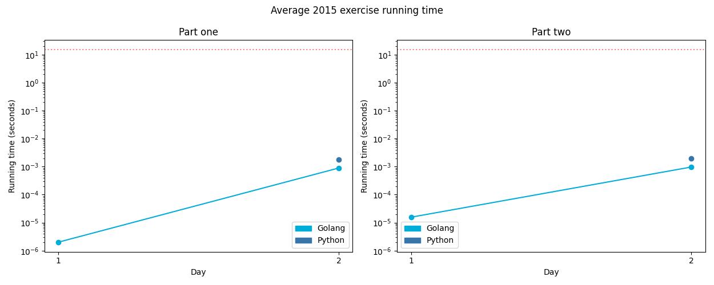

# [Day 1: Not Quite Lisp](https://adventofcode.com/2015/day/1)

<!-- [Day 1: Not Quite Lisp](01-notQuiteLisp) -->

## Go

```text
2015-1 Not Quite Lisp (Golang)

Running...

Test 1.0: pass in 800 ns
Test 1.1: pass in 1 µs
Test 1.2: pass in 900 ns
Test 1.3: pass in 1 µs
Test 1.4: pass in 900 ns
Test 1.5: pass in 900 ns
Test 1.6: pass in 1.4 µs
Test 1.7: pass in 1.2 µs
Test 1.8: pass in 1.2 µs
Test 2.0: pass in 700 ns
Test 2.1: pass in 600 ns
Part 1: 280 in 1.1 µs
Part 2: 1797 in 7 µs
```

## Python

```text
2015-1 Not Quite Lisp (Python)

Running...

Test 1.0: pass in 4 µs
Test 1.1: pass in 2.8 µs
Test 1.2: pass in 5.4 µs
Test 1.3: pass in 5.9 µs
Test 1.4: pass in 5.9 µs
Test 1.5: pass in 5.9 µs
Test 1.6: pass in 5.4 µs
Test 1.7: pass in 5.7 µs
Test 1.8: pass in 6.4 µs
Test 2.0: pass in 6.6 µs
Test 2.1: pass in 21.6 µs
Part 1: 280 in 67.9 µs
Part 2: 1797 in 119.6 µs
```

## 2015 Run Times


