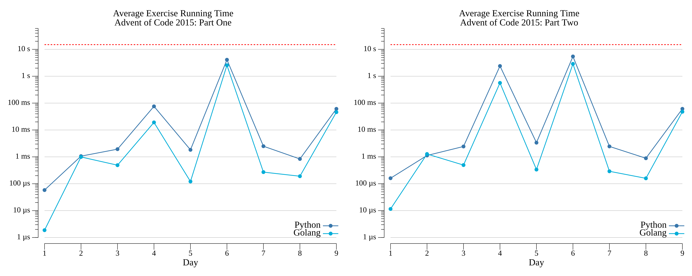

# [Day 3: Perfectly Spherical Houses In A Vacuum](https://adventofcode.com/2015/day/3)

<!-- These are helper text to make formatting the yearly readme consistent and easier...

[Day 3: Perfectly Spherical Houses In A Vacuum][rm3]
[Go][g3]
[Python][p3]

[rm3]: 03-perfectlySphericalHousesInAVacuum/README.md
[g3]: 03-perfectlySphericalHousesInAVacuum/go
[p3]: 03-perfectlySphericalHousesInAVacuum/py

-->

## Go

```text
    < section intentionally left blank >
```

## Python

```text
    < section intentionally left blank >
```

## 2015 Run Times


