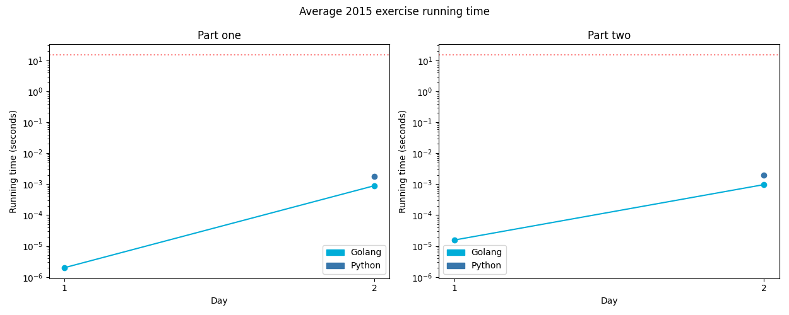

# [Day 19: Medicine for Rudolph](https://adventofcode.com/2015/day/19)

<!-- These are helper text to make formatting the yearly readme consistent and easier...

[Day 19: Medicine for Rudolph][rm19]
[Go][go19]
[Python][py19]

[rm19]: 19-medicineForRudolph/README.md
[go19]: 19-medicineForRudolph/go
[py19]: 19-medicineForRudolph/py

-->

## Go

```text
< section intentionally left blank >
```

## Python

```text
< section intentionally left blank >
```

## 2015 Run Times


