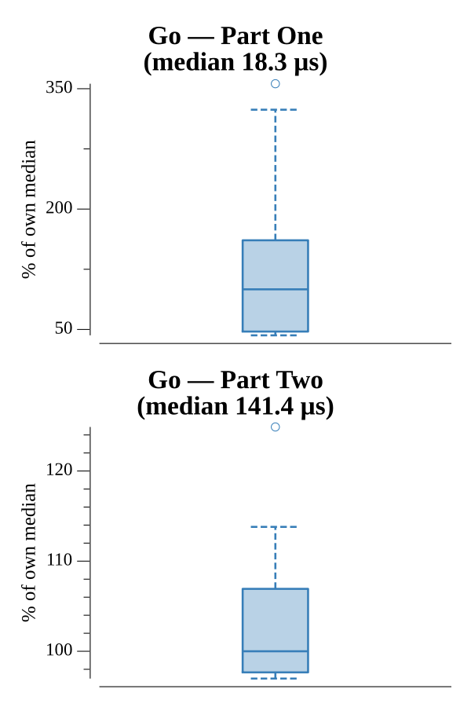

# [Day 1: No Time For A Taxicab](https://adventofcode.com/2016/day/1)

<!-- These are helper text to make formatting the yearly readme consistent and easier...

[Day 1: No Time For A Taxicab][rm01]
[Go][go01]

[rm01]: 01-noTimeForATaxicab/README.md
[go01]: 01-noTimeForATaxicab/go

-->

## Go

```text
────────────────────────────────────────
─  2016 Day 1: No Time For A Taxicab   ─
────────────────────────────────────────
Solving (Go)…
1.0:  PASS             9.964µs
2.0:  PASS           152.307µs
```

## Run Times


