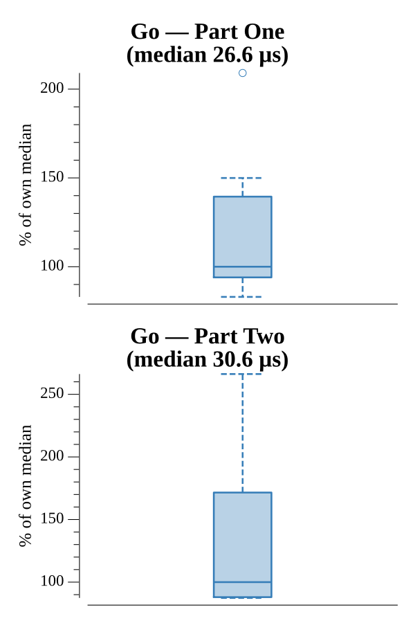

# [Day 2: Bathroom Security](https://adventofcode.com/2016/day/2)

<!-- These are helper text to make formatting the yearly readme consistent and easier...

[Day 2: Bathroom Security][rm2]
[Go][go2]

[rm2]: 02-bathroomSecurity/README.md
[go2]: 02-bathroomSecurity/go

-->

## Go

```text
────────────────────────────────────────
─    2016 Day 2: Bathroom Security     ─
────────────────────────────────────────
Solving (Go)…
1.0:  PASS            26.301µs
2.0:  PASS            27.519µs
```

## Run Times


