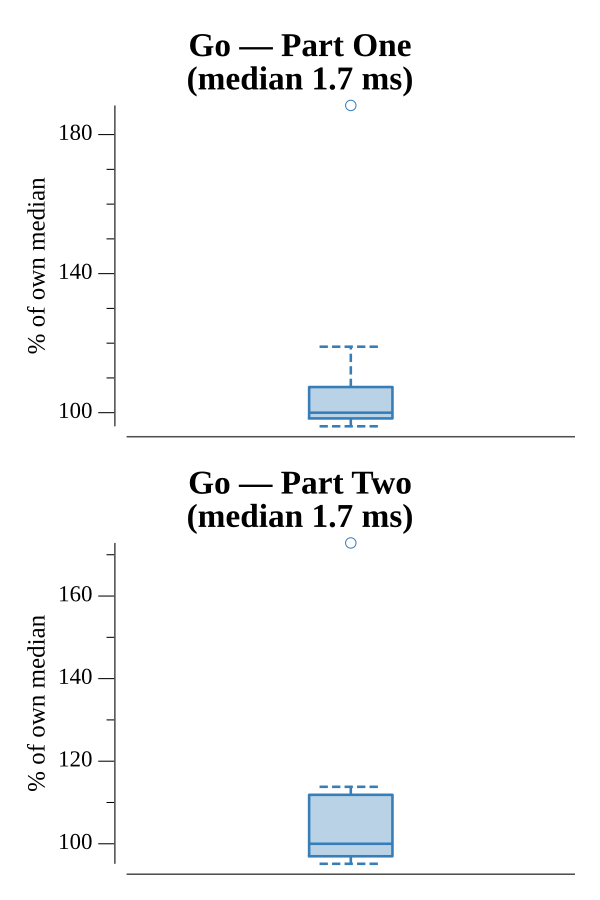

# [Day 3: Squares With Three Sides](https://adventofcode.com/2016/day/3)

<!-- These are helper text to make formatting the yearly readme consistent and easier...

[Day 3: Squares With Three Sides][rm3]
[Go][go3]

[rm3]: 03-squaresWithThreeSides/README.md
[go3]: 03-squaresWithThreeSides/go

-->

## Go

```text
────────────────────────────────────────
─ 2016 Day 3: Squares With Three Sides ─
────────────────────────────────────────
Solving (Go)…
1.0:  PASS             2.102ms
2.0:  PASS             1.664ms
```

## Run Times


