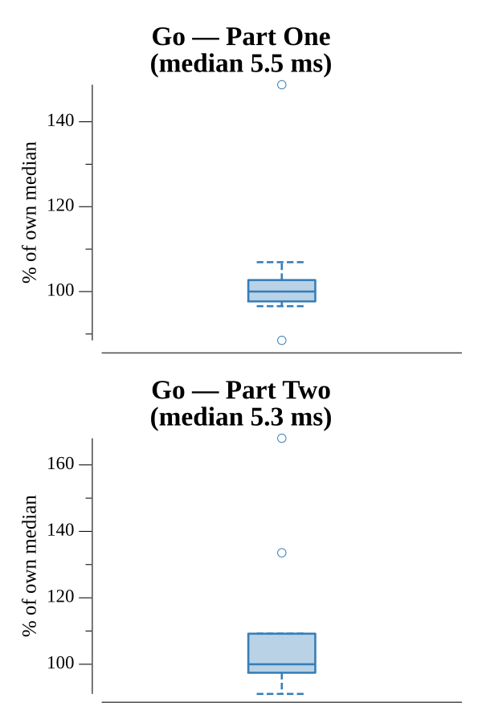

# [Day 4: Security Through Obscurity](https://adventofcode.com/2016/day/4)

<!-- These are helper text to make formatting the yearly readme consistent and easier...

[Day 4: Security Through Obscurity][rm4]
[Go][go4]

[rm4]: 04-securityThroughObscurity/README.md
[go4]: 04-securityThroughObscurity/go

-->

## Go

```text
────────────────────────────────────────
─2016 Day 4: Security Through Obscurity─
────────────────────────────────────────
Solving (Go)…
1.0:  PASS             6.161ms
2.0:  PASS             7.470ms
```

## Run Times


