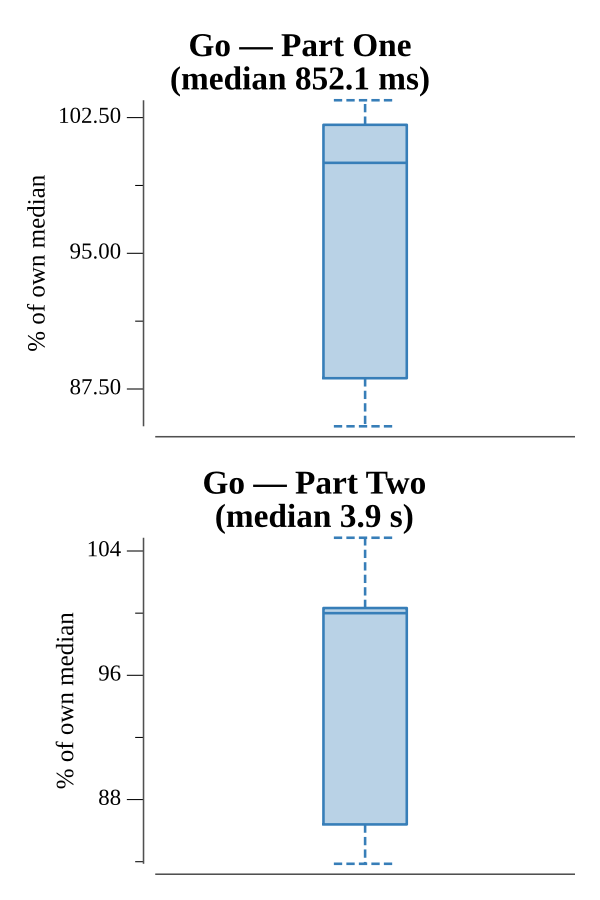

# [Day 5: How About a Nice Game of Chess?](https://adventofcode.com/2016/day/5)

<!-- These are helper text to make formatting the yearly readme consistent and easier...

[Day 5: How About a Nice Game of Chess?][rm5]
[Go][go5]

[rm5]: 05-howAboutANiceGameOfChess/README.md
[go5]: 05-howAboutANiceGameOfChess/go

-->

## Go

```text
────────────────────────────────────────
─ 2016 Day 5: How About a Nice Game of ─
─                Chess?                ─
Solving (Go)…
1.0:  PASS              0.931s
2.0:  PASS              4.082s
```

## Run Times


