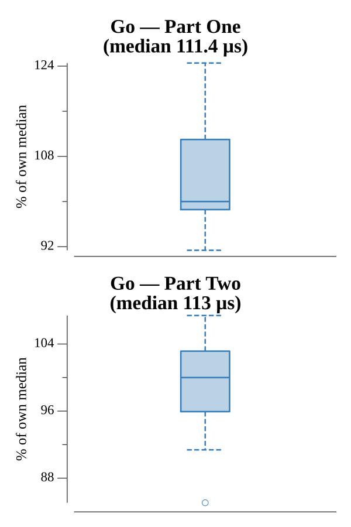

# [Day 6: Signals and Noise](https://adventofcode.com/2016/day/6)

<!-- These are helper text to make formatting the yearly readme consistent and easier...

[Day 6: Signals and Noise][rm6]
[Go][go6]

[rm6]: 06-signalsAndNoise/README.md
[go6]: 06-signalsAndNoise/go

-->

## Go

```text
────────────────────────────────────────
─    2016 Day 6: Signals and Noise     ─
────────────────────────────────────────
Solving (Go)…
1.0:  PASS           114.562µs
2.0:  PASS           151.138µs
```

## Run Times


