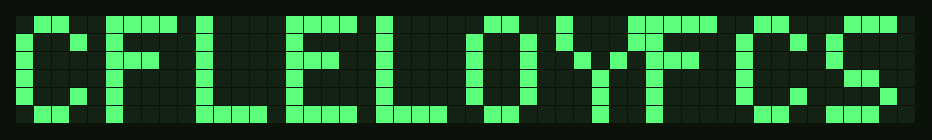
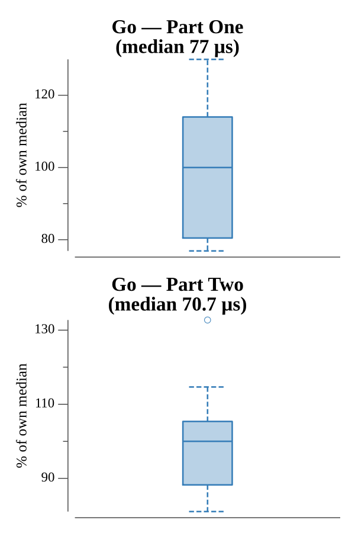

# [Day 8: Two-Factor Authentication](https://adventofcode.com/2016/day/8)

<!-- These are helper text to make formatting the yearly readme consistent and easier...

[Day 8: Two-Factor Authentication][rm8]
[Go][go8]

[rm8]: 08-two-FactorAuthentication/README.md
[go8]: 08-two-FactorAuthentication/go

-->

## Go

```text
────────────────────────────────────────
─2016 Day 8: Two-Factor Authentication ─
────────────────────────────────────────
Solving (Go)…
1.0:  PASS            60.434µs
2.0:  PASS            71.581µs
```

## Visualization

The lit pixels of the final screen spell out the Part Two answer.



## Run Times


