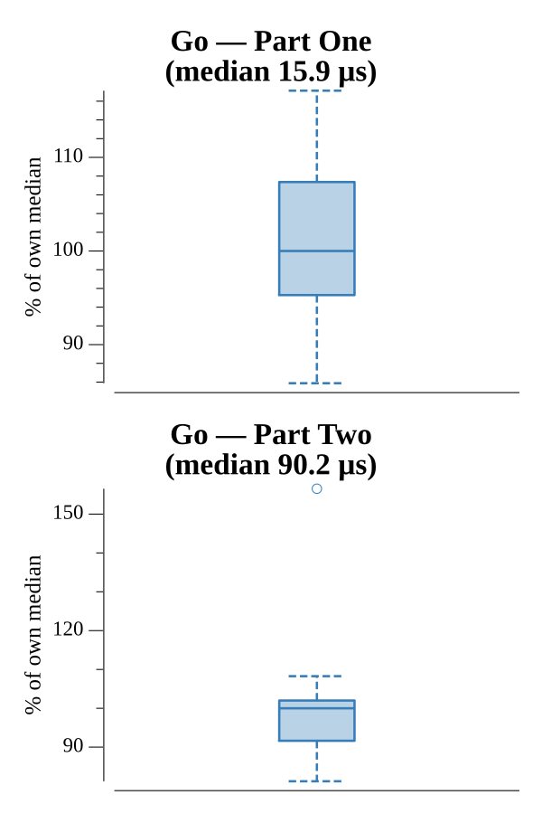

# [Day 9: Explosives in Cyberspace](https://adventofcode.com/2016/day/9)

<!-- These are helper text to make formatting the yearly readme consistent and easier...

[Day 9: Explosives in Cyberspace][rm9]
[Go][go9]

[rm9]: 09-explosivesInCyberspace/README.md
[go9]: 09-explosivesInCyberspace/go

-->

## Go

```text
────────────────────────────────────────
─ 2016 Day 9: Explosives in Cyberspace ─
────────────────────────────────────────
Solving (Go)…
1.0:  PASS            15.950µs
2.0:  PASS            86.213µs
```

## Run Times


