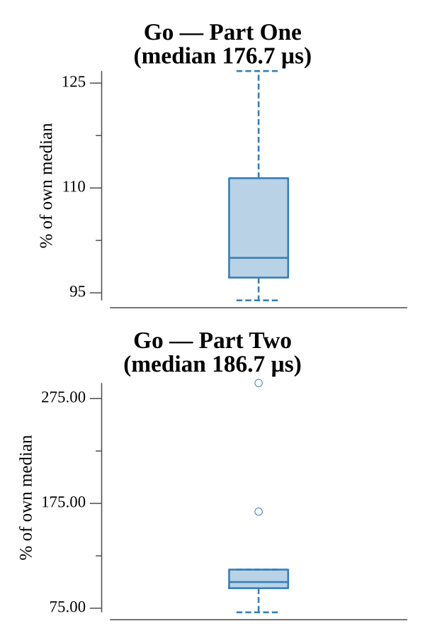

# [Day 10: Balance Bots](https://adventofcode.com/2016/day/10)

<!-- These are helper text to make formatting the yearly readme consistent and easier...

[Day 10: Balance Bots][rm10]
[Go][go10]

[rm10]: 10-balanceBots/README.md
[go10]: 10-balanceBots/go

-->

## Go

```text
────────────────────────────────────────
─      2016 Day 10: Balance Bots       ─
────────────────────────────────────────
Solving (Go)…
1.0:  PASS           233.521µs
2.0:  PASS           177.941µs
```

## Run Times


