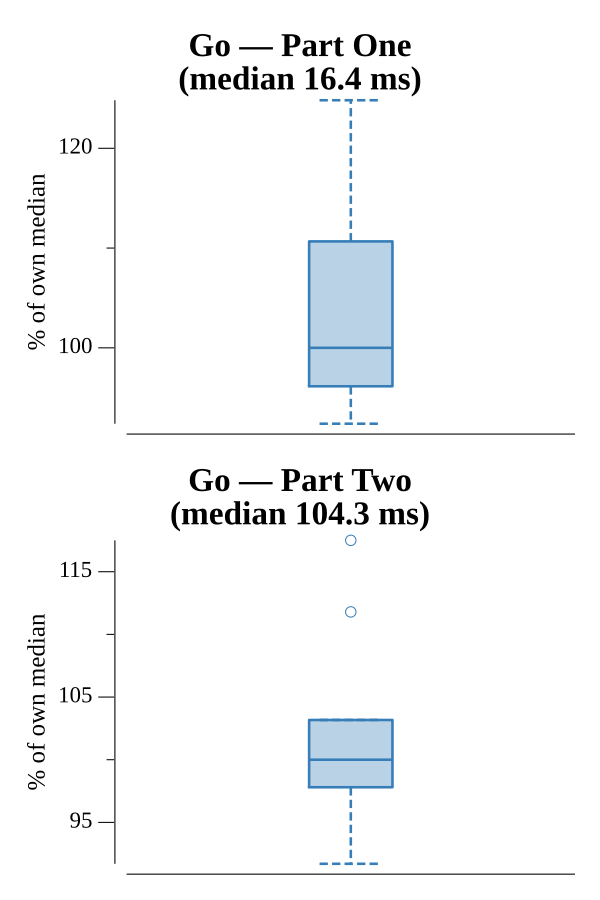

# [Day 11: Radioisotope Thermoelectric Generators](https://adventofcode.com/2016/day/11)

<!-- These are helper text to make formatting the yearly readme consistent and easier...

[Day 11: Radioisotope Thermoelectric Generators][rm11]
[Go][go11]

[rm11]: 11-radioisotopeThermoelectricGenerators/README.md
[go11]: 11-radioisotopeThermoelectricGenerators/go

-->

## Go

```text
────────────────────────────────────────
─      2016 Day 11: Radioisotope       ─
─      Thermoelectric Generators       ─
────────────────────────────────────────
Solving (Go)…
1.0:  PASS            16.748ms
2.0:  PASS           106.594ms
```

## Run Times


