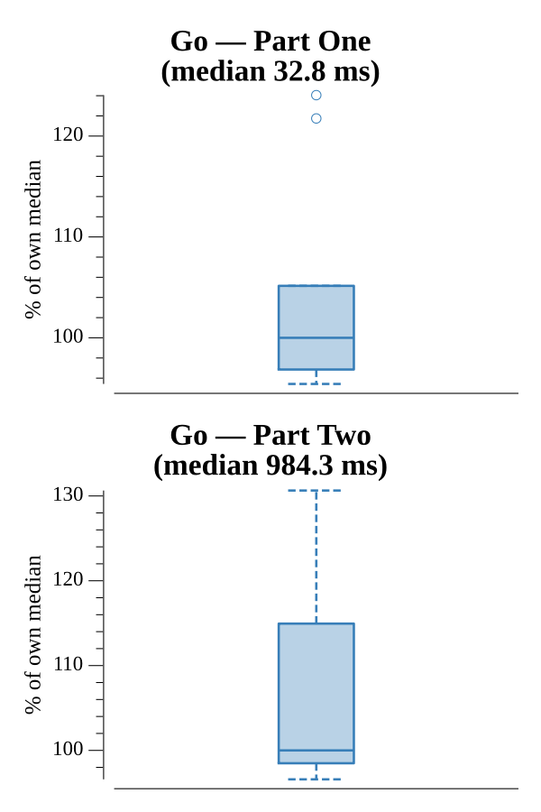

# [Day 12: Leonardo's Monorail](https://adventofcode.com/2016/day/12)

<!-- These are helper text to make formatting the yearly readme consistent and easier...

[Day 12: Leonardo's Monorail][rm12]
[Go][go12]

[rm12]: 12-leonardosMonorail/README.md
[go12]: 12-leonardosMonorail/go

-->

## Go

```text
────────────────────────────────────────
─   2016 Day 12: Leonardo's Monorail   ─
────────────────────────────────────────
Solving (Go)…
1.0:  PASS              0.046s
2.0:  PASS              1.265s
```

## Run Times


