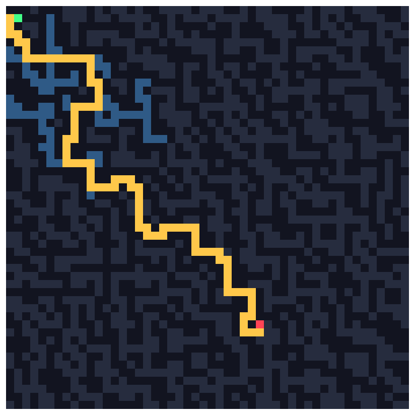
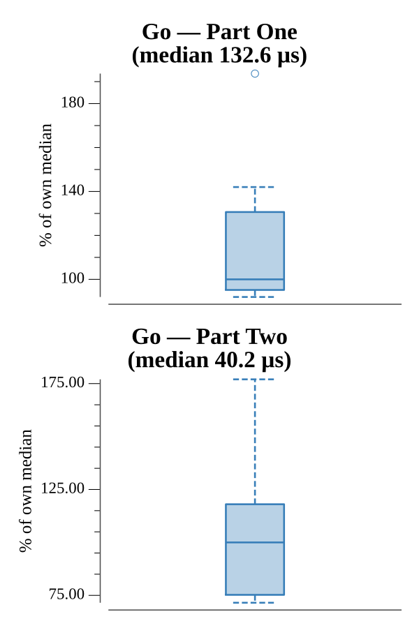

# [Day 13: A Maze of Twisty Little Cubicles](https://adventofcode.com/2016/day/13)

<!-- These are helper text to make formatting the yearly readme consistent and easier...

[Day 13: A Maze of Twisty Little Cubicles][rm13]
[Go][go13]

[rm13]: 13-aMazeOfTwistyLittleCubicles/README.md
[go13]: 13-aMazeOfTwistyLittleCubicles/go

-->

## Go

```text
────────────────────────────────────────
─ 2016 Day 13: A Maze of Twisty Little ─
─               Cubicles               ─
Solving (Go)…
1.0:  PASS           123.020µs
2.0:  PASS            37.820µs
```

## Visualization

The gold path is the shortest route from start (green) to the target (red); the
blue region is everything reachable within 50 steps.



## Run Times


