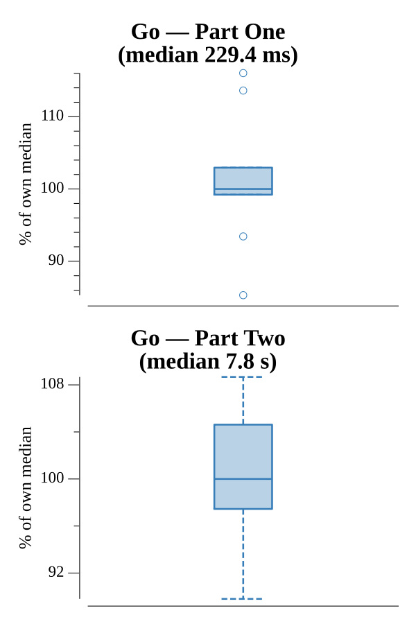

# [Day 14: One-Time Pad](https://adventofcode.com/2016/day/14)

<!-- These are helper text to make formatting the yearly readme consistent and easier...

[Day 14: One-Time Pad][rm14]
[Go][go14]

[rm14]: 14-one-TimePad/README.md
[go14]: 14-one-TimePad/go

-->

## Go

```text
────────────────────────────────────────
─      2016 Day 14: One-Time Pad       ─
────────────────────────────────────────
Solving (Go)…
1.0:  PASS              0.235s
2.0:  PASS              7.869s
```

## Run Times


