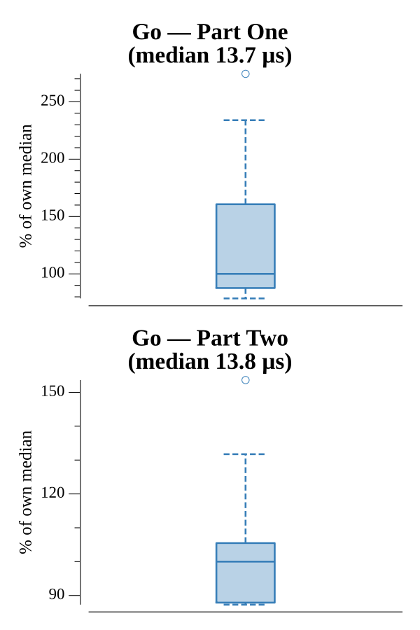

# [Day 15: Timing is Everything](https://adventofcode.com/2016/day/15)

<!-- These are helper text to make formatting the yearly readme consistent and easier...

[Day 15: Timing is Everything][rm15]
[Go][go15]

[rm15]: 15-timingIsEverything/README.md
[go15]: 15-timingIsEverything/go

-->

## Go

```text
────────────────────────────────────────
─  2016 Day 15: Timing is Everything   ─
────────────────────────────────────────
Solving (Go)…
1.0:  PASS            11.266µs
2.0:  PASS            10.901µs
```

## Run Times


