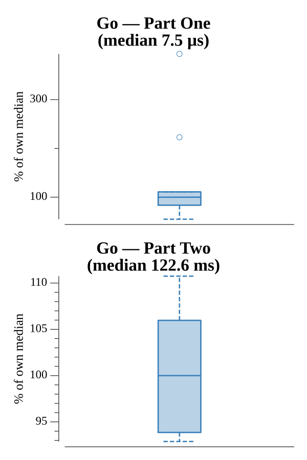

# [Day 16: Dragon Checksum](https://adventofcode.com/2016/day/16)

<!-- These are helper text to make formatting the yearly readme consistent and easier...

[Day 16: Dragon Checksum][rm16]
[Go][go16]

[rm16]: 16-dragonChecksum/README.md
[go16]: 16-dragonChecksum/go

-->

## Go

```text
────────────────────────────────────────
─     2016 Day 16: Dragon Checksum     ─
────────────────────────────────────────
Solving (Go)…
1.0:  PASS             0.005ms
2.0:  PASS           115.700ms
```

## Run Times


