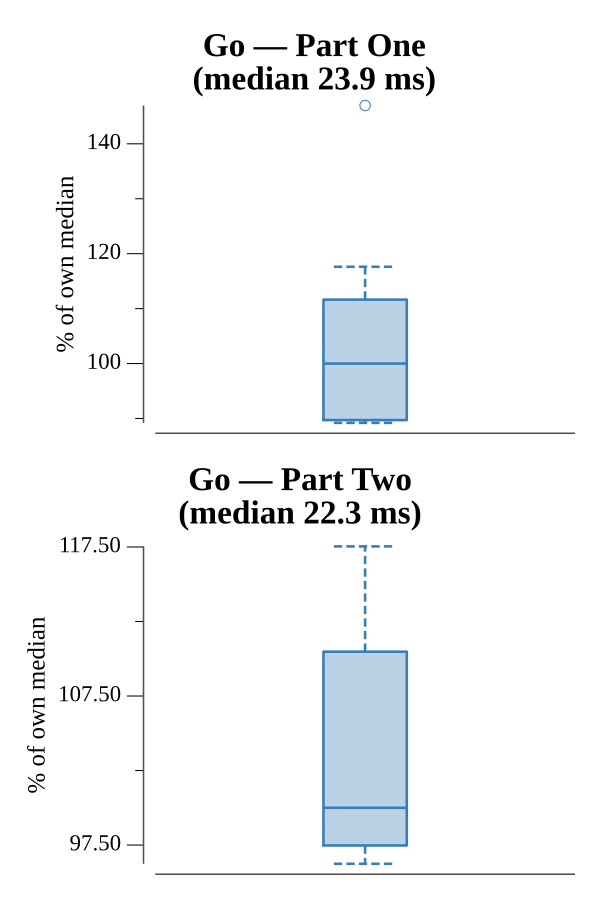

# [Day 17: Two Steps Forward](https://adventofcode.com/2016/day/17)

<!-- These are helper text to make formatting the yearly readme consistent and easier...

[Day 17: Two Steps Forward][rm17]
[Go][go17]

[rm17]: 17-twoStepsForward/README.md
[go17]: 17-twoStepsForward/go

-->

## Go

```text
────────────────────────────────────────
─    2016 Day 17: Two Steps Forward    ─
────────────────────────────────────────
Solving (Go)…
1.0:  PASS            22.395ms
2.0:  PASS            21.630ms
```

## Run Times


