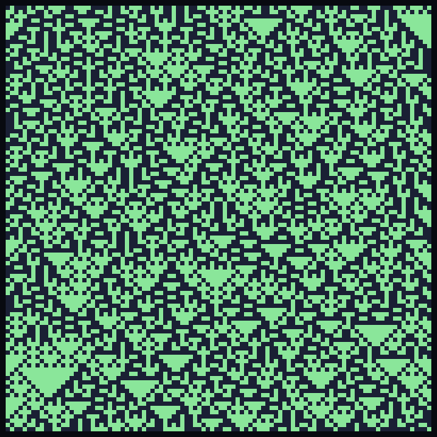
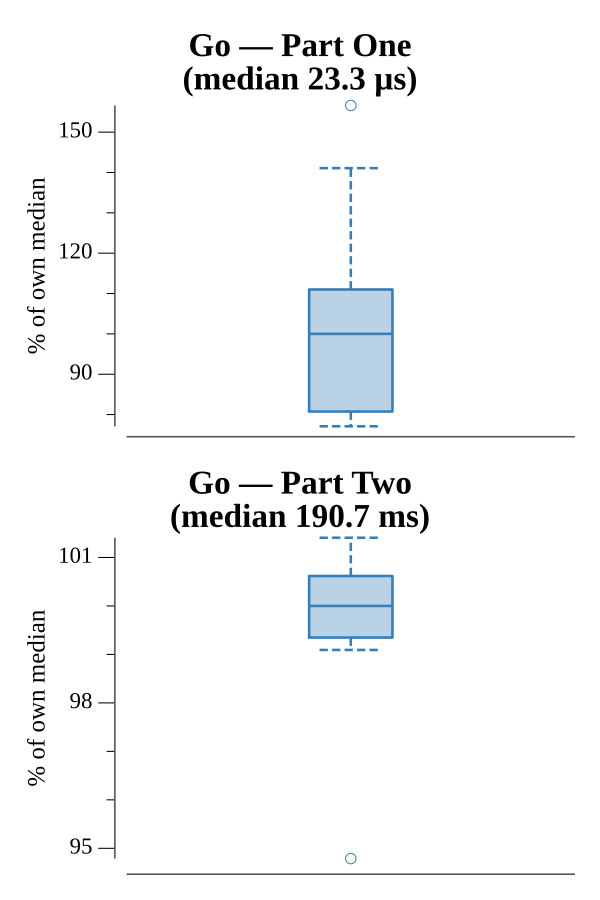

# [Day 18: Like a Rogue](https://adventofcode.com/2016/day/18)

<!-- These are helper text to make formatting the yearly readme consistent and easier...

[Day 18: Like a Rogue][rm18]
[Go][go18]

[rm18]: 18-likeARogue/README.md
[go18]: 18-likeARogue/go

-->

## Go

```text
────────────────────────────────────────
─      2016 Day 18: Like a Rogue       ─
────────────────────────────────────────
Solving (Go)…
1.0:  PASS             0.019ms
2.0:  PASS           196.618ms
```

## Visualization

The trap map (traps dark, safe tiles green) — the generation rule is Rule 90,
producing nested Sierpinski-style triangles.



## Run Times


