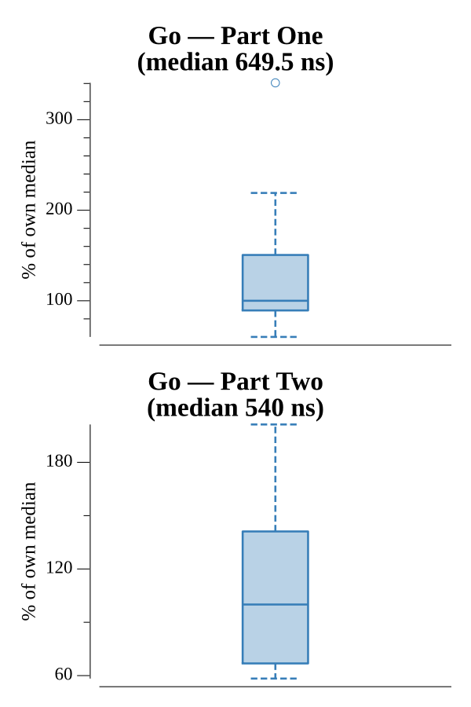

# [Day 19: An Elephant Named Joseph](https://adventofcode.com/2016/day/19)

<!-- These are helper text to make formatting the yearly readme consistent and easier...

[Day 19: An Elephant Named Joseph][rm19]
[Go][go19]

[rm19]: 19-anElephantNamedJoseph/README.md
[go19]: 19-anElephantNamedJoseph/go

-->

## Go

```text
────────────────────────────────────────
─2016 Day 19: An Elephant Named Joseph ─
────────────────────────────────────────
Solving (Go)…
1.0:  PASS             0.565µs
2.0:  PASS             0.685µs
```

## Run Times


