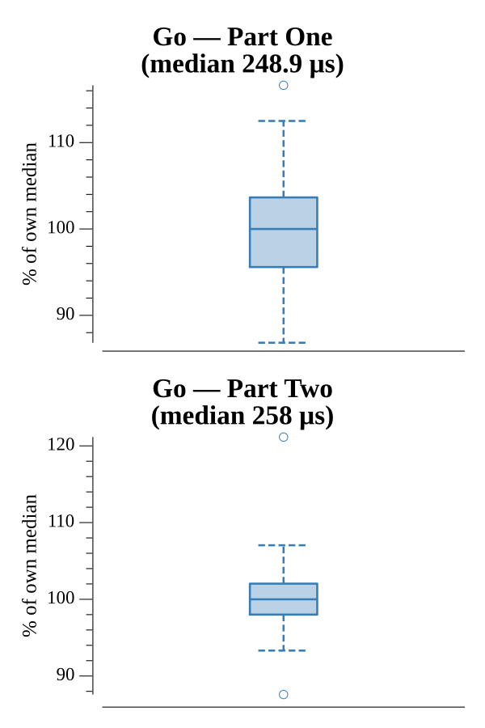

# [Day 20: Firewall Rules](https://adventofcode.com/2016/day/20)

<!-- These are helper text to make formatting the yearly readme consistent and easier...

[Day 20: Firewall Rules][rm20]
[Go][go20]

[rm20]: 20-firewallRules/README.md
[go20]: 20-firewallRules/go

-->

## Go

```text
────────────────────────────────────────
─     2016 Day 20: Firewall Rules      ─
────────────────────────────────────────
Solving (Go)…
1.0:  PASS           262.744µs
2.0:  PASS           260.514µs
```

## Run Times


