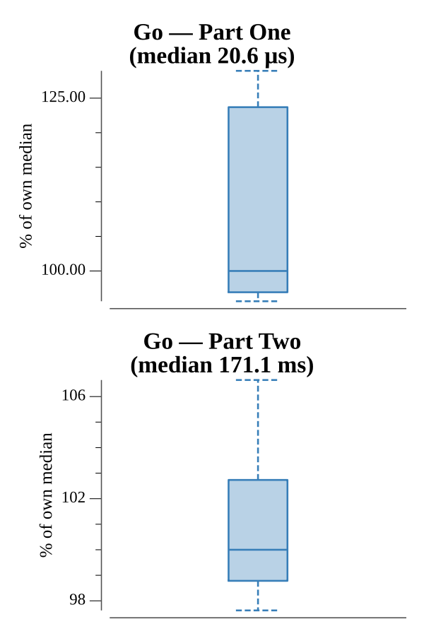

# [Day 21: Scrambled Letters and Hash](https://adventofcode.com/2016/day/21)

<!-- These are helper text to make formatting the yearly readme consistent and easier...

[Day 21: Scrambled Letters and Hash][rm21]
[Go][go21]

[rm21]: 21-scrambledLettersAndHash/README.md
[go21]: 21-scrambledLettersAndHash/go

-->

## Go

```text
────────────────────────────────────────
─  2016 Day 21: Scrambled Letters and  ─
─                 Hash                 ─
────────────────────────────────────────
Solving (Go)…
1.0:  PASS             0.020ms
2.0:  PASS           172.084ms
```

## Run Times


