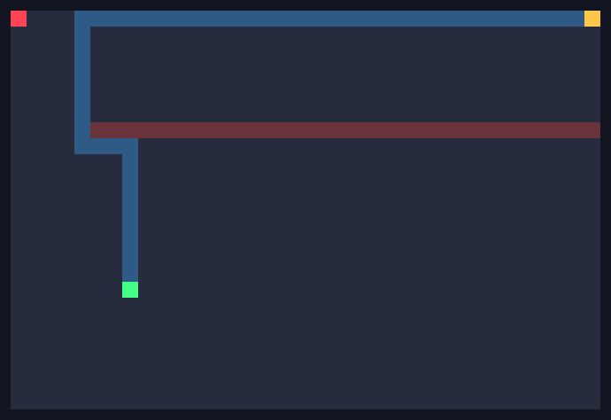
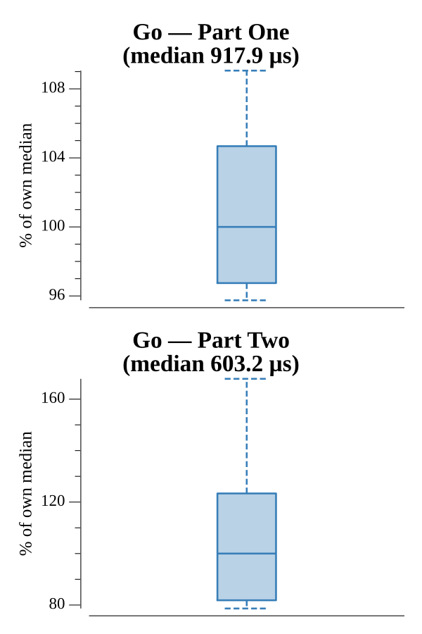

# [Day 22: Grid Computing](https://adventofcode.com/2016/day/22)

<!-- These are helper text to make formatting the yearly readme consistent and easier...

[Day 22: Grid Computing][rm22]
[Go][go22]

[rm22]: 22-gridComputing/README.md
[go22]: 22-gridComputing/go

-->

## Go

```text
────────────────────────────────────────
─     2016 Day 22: Grid Computing      ─
────────────────────────────────────────
Solving (Go)…
1.0:  PASS           946.807µs
2.0:  PASS           534.555µs
```

## Visualization

The cluster is a sliding puzzle. The over-full **wall band** (red) is
impassable; the lone **empty node** (green) is the only cell data can shuffle
into. Part Two walks the empty node up and around the wall, then along the top
row to the cell beside the **goal data** (gold, top-right), before sliding the
goal one column at a time toward the **origin** (red, top-left). The blue trace
is that route.



## Run Times


