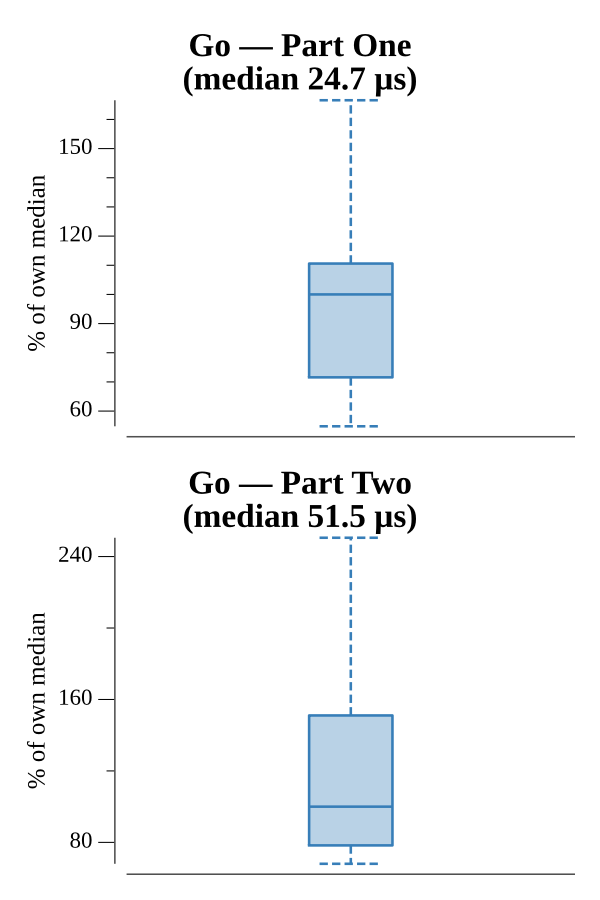

# [Day 23: Safe Cracking](https://adventofcode.com/2016/day/23)

<!-- These are helper text to make formatting the yearly readme consistent and easier...

[Day 23: Safe Cracking][rm23]
[Go][go23]

[rm23]: 23-safeCracking/README.md
[go23]: 23-safeCracking/go

-->

## Go

```text
────────────────────────────────────────
─      2016 Day 23: Safe Cracking      ─
────────────────────────────────────────
Solving (Go)…
1.0:  PASS            37.646µs
2.0:  PASS            83.487µs
```

## Run Times


