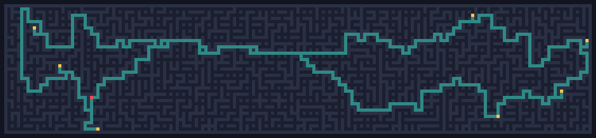
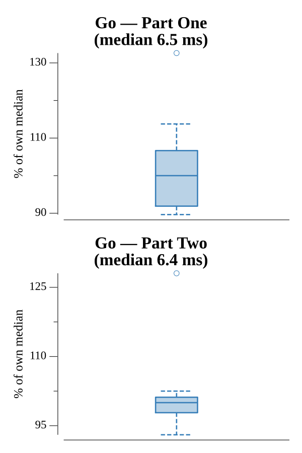

# [Day 24: Air Duct Spelunking](https://adventofcode.com/2016/day/24)

<!-- These are helper text to make formatting the yearly readme consistent and easier...

[Day 24: Air Duct Spelunking][rm24]
[Go][go24]

[rm24]: 24-airDuctSpelunking/README.md
[go24]: 24-airDuctSpelunking/go

-->

## Go

```text
────────────────────────────────────────
─   2016 Day 24: Air Duct Spelunking   ─
────────────────────────────────────────
Solving (Go)…
1.0:  PASS             7.968ms
2.0:  PASS             6.246ms
```

## Visualization

The maze with its numbered targets (gold) and start point `0` (red). BFS builds
a pairwise distance matrix between targets, then a permutation search finds the
shortest tour. The teal trace is the optimal Part Two route — visiting every
target and returning to `0`.



## Run Times


