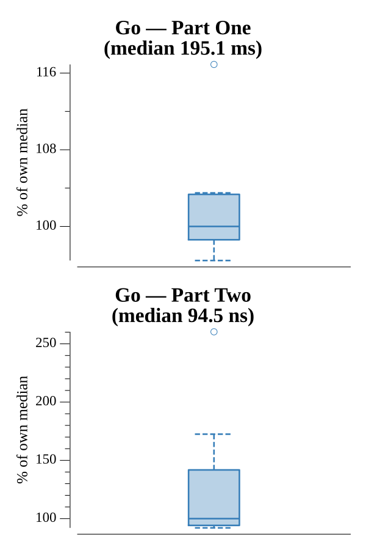

# [Day 25: Clock Signal](https://adventofcode.com/2016/day/25)

<!-- These are helper text to make formatting the yearly readme consistent and easier...

[Day 25: Clock Signal][rm25]
[Go][go25]

[rm25]: 25-clockSignal/README.md
[go25]: 25-clockSignal/go

-->

## Go

```text
────────────────────────────────────────
─      2016 Day 25: Clock Signal       ─
────────────────────────────────────────
Solving (Go)…
1.0:  PASS           254.192ms
2.0:  NEW              0.000ms
      Merry Christmas!
```

## Run Times


