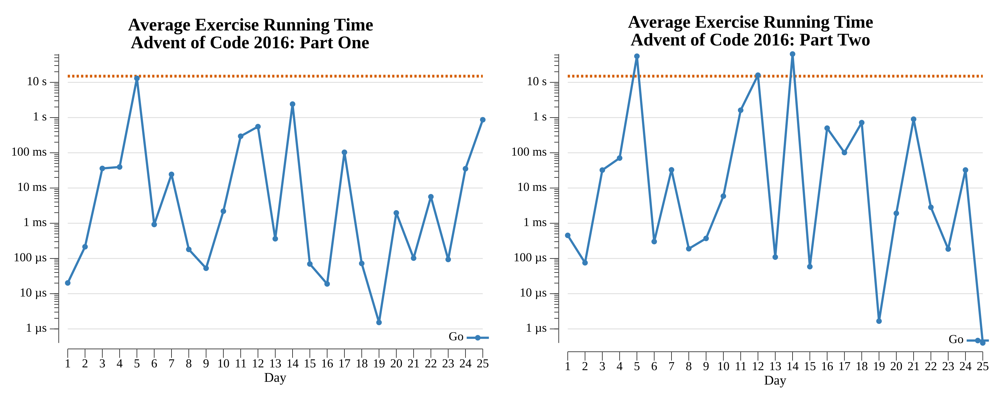

# Advent of Code: 2016

[Advent of Code 2016](https://adventofcode.com/2016) exercise solutions.

<!-- ★ ☆ -->

| Exercise                                                       | Stars | Solutions                     |
|----------------------------------------------------------------|:-----:|-------------------------------|
| [Day 1: No Time For A Taxicab](01-noTimeForATaxicab/README.md) |  ★ ★  | [Go](01-noTimeForATaxicab/go) |
| [Day 2: Bathroom Security](02-bathroomSecurity/README.md)      |  ★ ★  | [Go](02-bathroomSecurity/go)  |
| [Day 3: Squares With Three Sides](03-squaresWithThreeSides/README.md) |  ★ ★  | [Go](03-squaresWithThreeSides/go) |
| [Day 4: Security Through Obscurity](04-securityThroughObscurity/README.md) |  ★ ★  | [Go](04-securityThroughObscurity/go) |
| [Day 5: How About a Nice Game of Chess?](05-howAboutANiceGameOfChess/README.md) |  ★ ★  | [Go](05-howAboutANiceGameOfChess/go) |
| [Day 6: Signals and Noise](06-signalsAndNoise/README.md)       |  ★ ★  | [Go](06-signalsAndNoise/go)   |
| [Day 7: Internet Protocol Version 7](07-internetProtocolVersion7/README.md) |  ★ ★  | [Go](07-internetProtocolVersion7/go) |
| 8                                                              |  ☆ ☆  |                               |
| 9                                                              |  ☆ ☆  |                               |
| 10                                                             |  ☆ ☆  |                               |
| 11                                                             |  ☆ ☆  |                               |
| 12                                                             |  ☆ ☆  |                               |
| 13                                                             |  ☆ ☆  |                               |
| 14                                                             |  ☆ ☆  |                               |
| 15                                                             |  ☆ ☆  |                               |
| 16                                                             |  ☆ ☆  |                               |
| 17                                                             |  ☆ ☆  |                               |
| 18                                                             |  ☆ ☆  |                               |
| 19                                                             |  ☆ ☆  |                               |
| 20                                                             |  ☆ ☆  |                               |
| 21                                                             |  ☆ ☆  |                               |
| 22                                                             |  ☆ ☆  |                               |
| 23                                                             |  ☆ ☆  |                               |
| 24                                                             |  ☆ ☆  |                               |
| 25                                                             |  ☆ ☆  |                               |

## 2016 Run Times



## 2016 Personal Leaderboard

```text
      --------Part 1--------   --------Part 2--------
Day       Time   Rank  Score       Time   Rank  Score
  1       >24h  29891      0       >24h  23300      0
```
