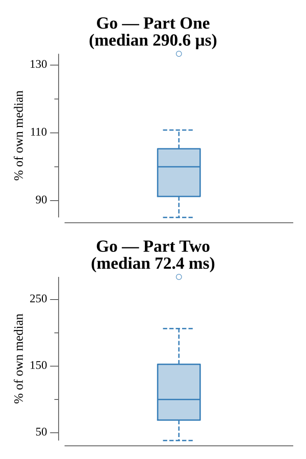

# [Day 1: Inverse Captcha](https://adventofcode.com/2017/day/1)

<!-- These are helper text to make formatting the yearly readme consistent and easier...

[Day 1: Inverse Captcha][rm01]
[Go][go01]

[rm01]: 01-inverseCaptcha/README.md
[go01]: 01-inverseCaptcha/go

-->

## Go

```text
────────────────────────────────────────
─     2017 Day 1: Inverse Captcha      ─
────────────────────────────────────────
Solving (Go)…
1.0:  PASS             7.087ms
2.0:  PASS            14.690ms
```

## Run Times


