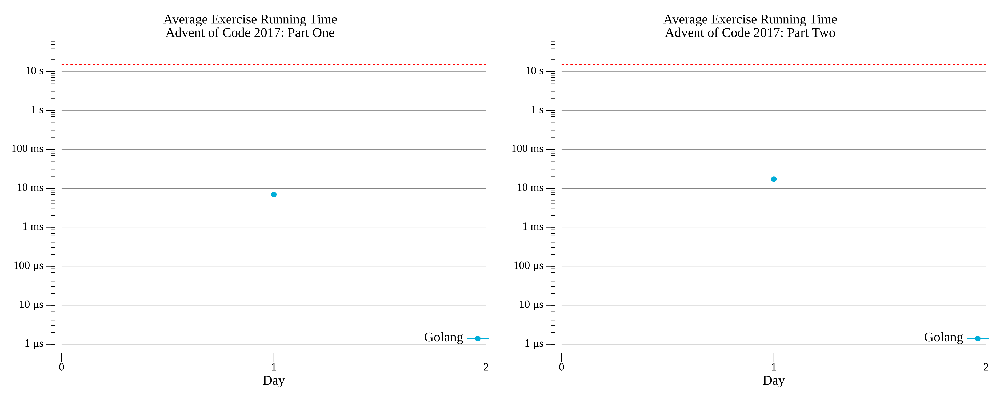

# [Day 1: Inverse Captcha](https://adventofcode.com/2017/day/1)

<!-- [Day 1: Inverse Captcha](01-inverseCaptcha) -->

## Go

```text
2017-1 Inverse Captcha (Golang)

Running...

Test 1.0: pass in 1.5 µs
Test 1.1: pass in 2.1 µs
Test 1.2: pass in 2.2 µs
Test 1.3: pass in 2.2 µs
Test 2.0: pass in 1.5 µs
Test 2.1: pass in 1.8 µs
Test 2.2: pass in 2.5 µs
Test 2.3: pass in 1.9 µs
Test 2.4: pass in 1.9 µs
Part 1: 1049 in 7.0604 ms
Part 2: 1508 in 20.5827 ms
```

## Python

```text
    < section intentionally left blank >
```

## 2017 Run Times


