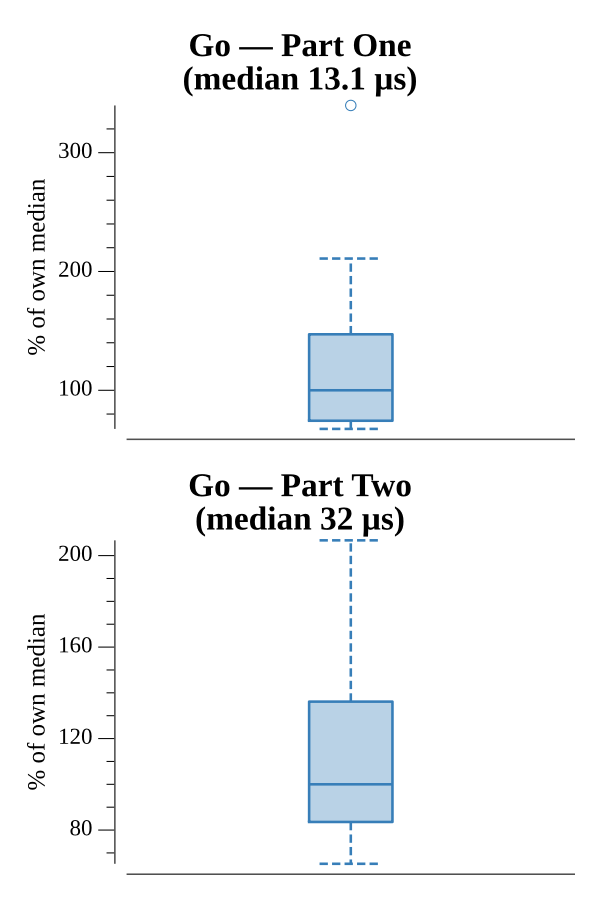

# [Day 2: Corruption Checksum](https://adventofcode.com/2017/day/2)

<!-- These are helper text to make formatting the yearly readme consistent and easier...

[Day 2: Corruption Checksum][rm02]
[Go][go02]

[rm02]: 02-corruptionChecksum/README.md
[go02]: 02-corruptionChecksum/go

-->

## Go

```text
────────────────────────────────────────
─   2017 Day 2: Corruption Checksum    ─
────────────────────────────────────────
Solving (Go)…
1.0:  PASS            21.861µs
2.0:  PASS            27.822µs
```

## Run Times


