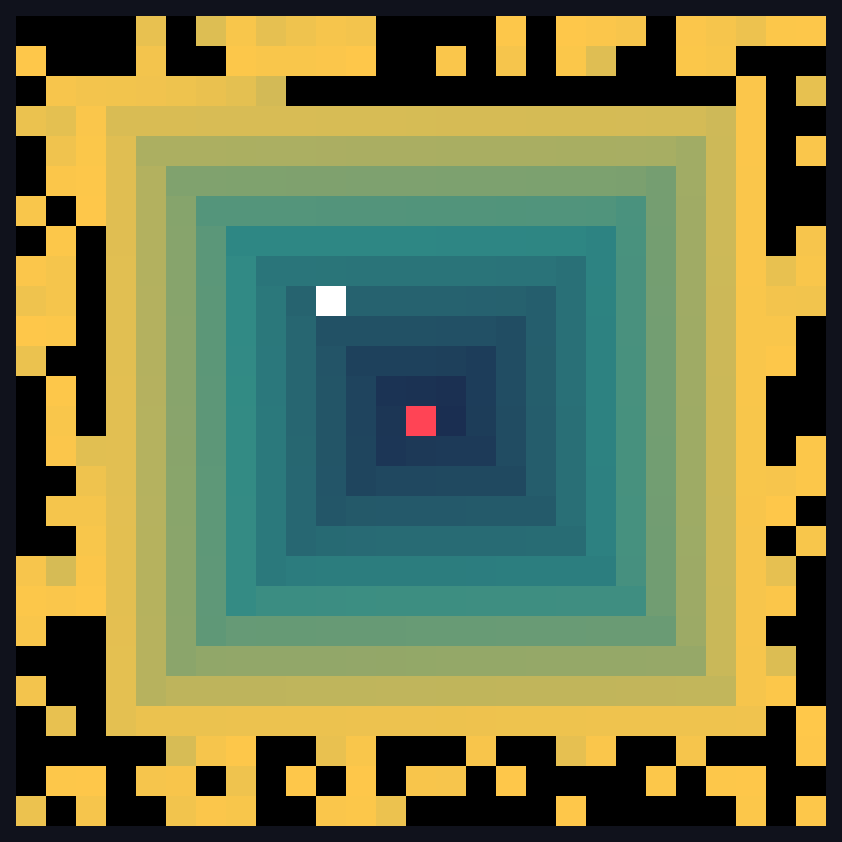
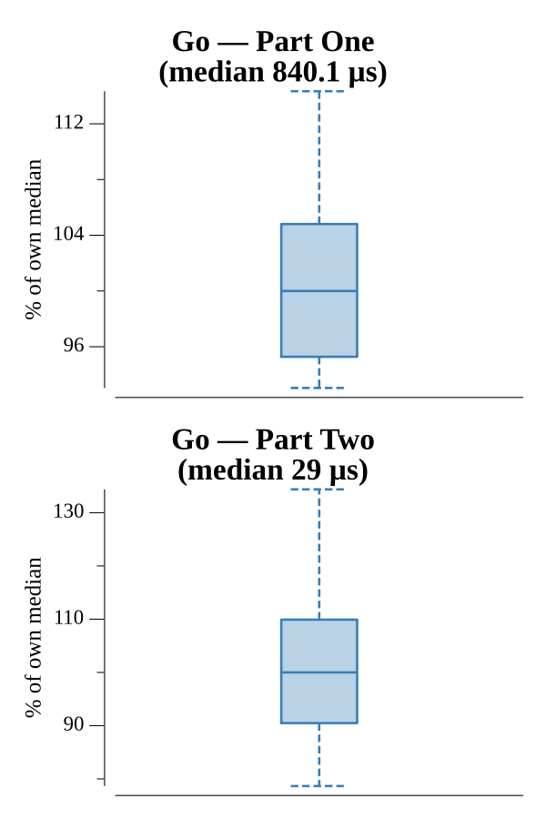

# [Day 3: Spiral Memory](https://adventofcode.com/2017/day/3)

<!-- These are helper text to make formatting the yearly readme consistent and easier...

[Day 3: Spiral Memory][rm03]
[Go][go03]

[rm03]: 03-spiralMemory/README.md
[go03]: 03-spiralMemory/go

-->

## Go

```text
────────────────────────────────────────
─      2017 Day 3: Spiral Memory       ─
────────────────────────────────────────
Solving (Go)…
1.0:  PASS           861.938µs
2.0:  PASS            28.329µs
```

## Visualization

The Part Two spiral, where each square stores the sum of its already-filled
neighbours (including diagonals). Cells are coloured by log-scaled value, so the
exponential growth radiating from the centre (red, square `1`) shows as
concentric rings shifting dark blue → cyan → gold. The white square is the first
value to exceed the puzzle input — where the walk stops.



## Run Times


