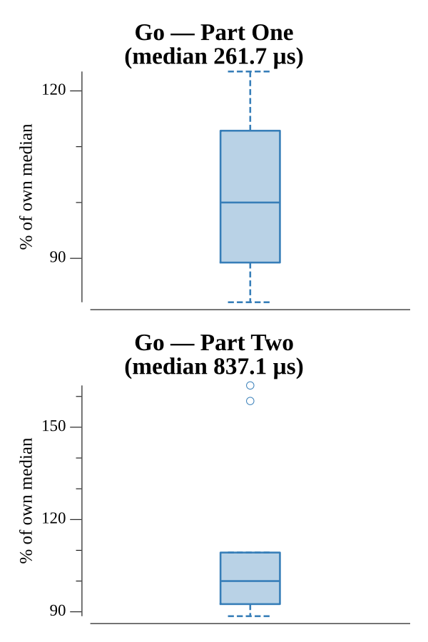

# [Day 4: High-Entropy Passphrases](https://adventofcode.com/2017/day/4)

<!-- These are helper text to make formatting the yearly readme consistent and easier...

[Day 4: High-Entropy Passphrases][rm04]
[Go][go04]

[rm04]: 04-high-EntropyPassphrases/README.md
[go04]: 04-high-EntropyPassphrases/go

-->

## Go

```text
────────────────────────────────────────
─ 2017 Day 4: High-Entropy Passphrases ─
────────────────────────────────────────
Solving (Go)…
1.0:  PASS           281.597µs
2.0:  PASS           948.568µs
```

## Run Times


