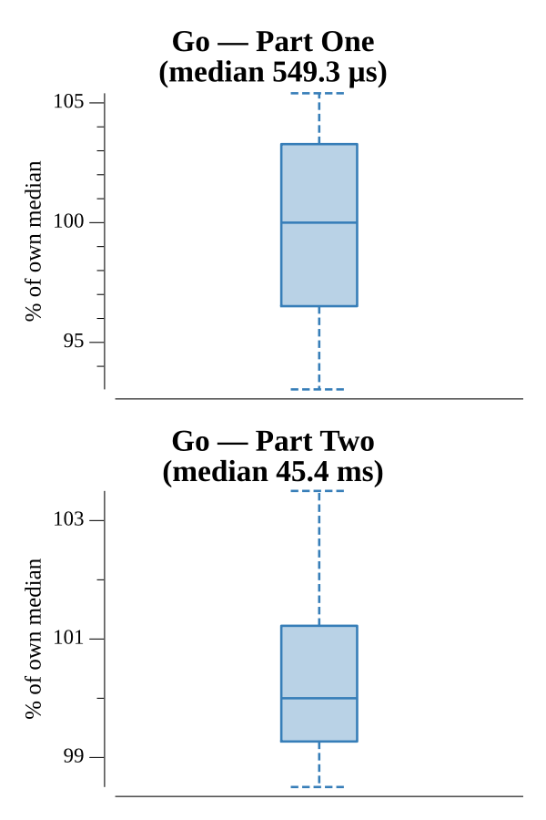

# [Day 5: A Maze of Twisty Trampolines, All Alike](https://adventofcode.com/2017/day/5)

<!-- These are helper text to make formatting the yearly readme consistent and easier...

[Day 5: A Maze of Twisty Trampolines, All Alike][rm05]
[Go][go05]

[rm05]: 05-aMazeOfTwistyTrampolinesAllAlike/README.md
[go05]: 05-aMazeOfTwistyTrampolinesAllAlike/go

-->

## Go

```text
────────────────────────────────────────
─     2017 Day 5: A Maze of Twisty     ─
─        Trampolines, All Alike        ─
────────────────────────────────────────
Solving (Go)…
1.0:  PASS             0.580ms
2.0:  PASS            46.882ms
```

## Run Times


