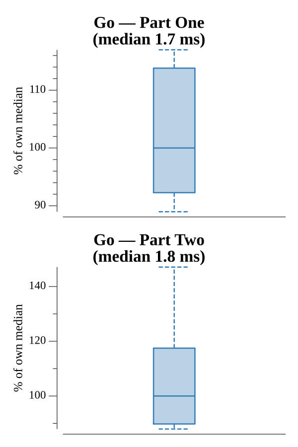

# [Day 6: Memory Reallocation](https://adventofcode.com/2017/day/6)

<!-- These are helper text to make formatting the yearly readme consistent and easier...

[Day 6: Memory Reallocation][rm06]
[Go][go06]

[rm06]: 06-memoryReallocation/README.md
[go06]: 06-memoryReallocation/go

-->

## Go

```text
────────────────────────────────────────
─   2017 Day 6: Memory Reallocation    ─
────────────────────────────────────────
Solving (Go)…
1.0:  PASS             1.918ms
2.0:  PASS             2.110ms
```

## Run Times


