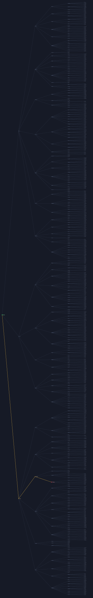
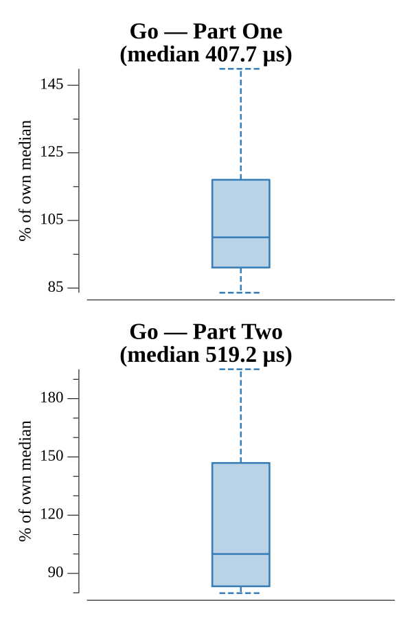

# [Day 7: Recursive Circus](https://adventofcode.com/2017/day/7)

<!-- These are helper text to make formatting the yearly readme consistent and easier...

[Day 7: Recursive Circus][rm07]
[Go][go07]

[rm07]: 07-recursiveCircus/README.md
[go07]: 07-recursiveCircus/go

-->

## Go

```text
────────────────────────────────────────
─     2017 Day 7: Recursive Circus     ─
────────────────────────────────────────
Solving (Go)…
1.0:  PASS           483.489µs
2.0:  PASS           505.596µs
```

## Visualization

The full 1083-program tower as a layered dendrogram (SVG). The balanced
structure is drawn faintly; the highlighted gold path runs from the root
(green) down to the single unbalanced program (red), four levels deep — the one
whose corrected weight rebalances the whole tower.



## Run Times


