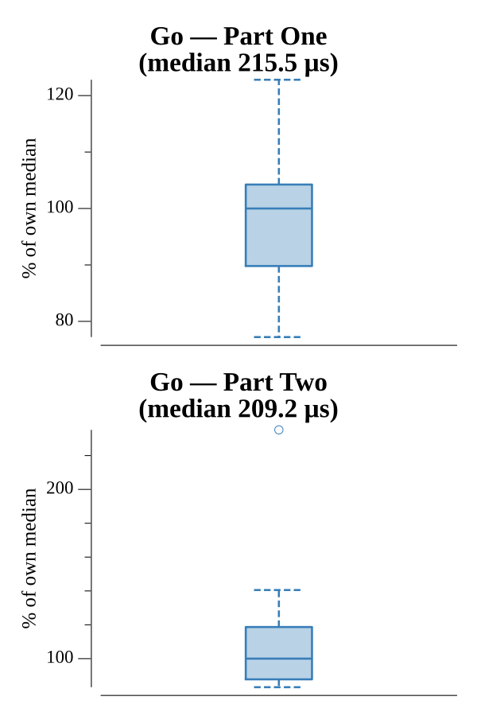

# [Day 8: I Heard You Like Registers](https://adventofcode.com/2017/day/8)

<!-- These are helper text to make formatting the yearly readme consistent and easier...

[Day 8: I Heard You Like Registers][rm08]
[Go][go08]

[rm08]: 08-iHeardYouLikeRegisters/README.md
[go08]: 08-iHeardYouLikeRegisters/go

-->

## Go

```text
────────────────────────────────────────
─2017 Day 8: I Heard You Like Registers─
────────────────────────────────────────
Solving (Go)…
1.0:  PASS           221.170µs
2.0:  PASS           223.176µs
```

## Run Times


