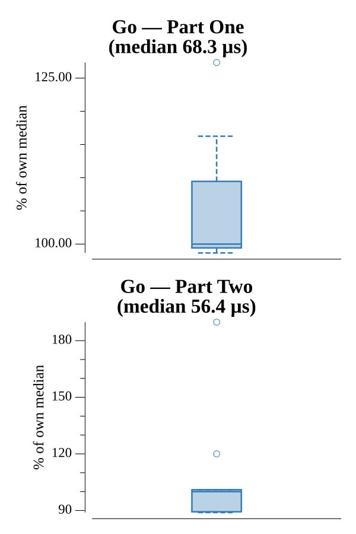

# [Day 9: Stream Processing](https://adventofcode.com/2017/day/9)

<!-- These are helper text to make formatting the yearly readme consistent and easier...

[Day 9: Stream Processing][rm09]
[Go][go09]

[rm09]: 09-streamProcessing/README.md
[go09]: 09-streamProcessing/go

-->

## Go

```text
────────────────────────────────────────
─    2017 Day 9: Stream Processing     ─
────────────────────────────────────────
Solving (Go)…
1.0:  PASS            68.563µs
2.0:  PASS            56.077µs
```

## Run Times


