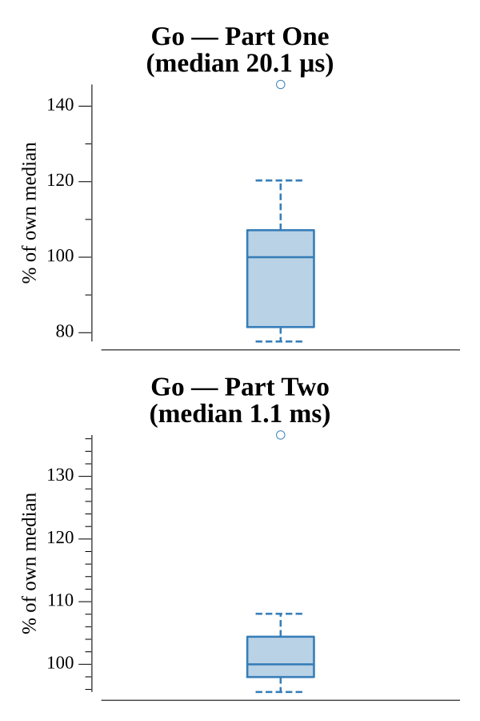

# [Day 10: Knot Hash](https://adventofcode.com/2017/day/10)

<!-- These are helper text to make formatting the yearly readme consistent and easier...

[Day 10: Knot Hash][rm10]
[Go][go10]

[rm10]: 10-knotHash/README.md
[go10]: 10-knotHash/go

-->

## Go

```text
────────────────────────────────────────
─        2017 Day 10: Knot Hash        ─
────────────────────────────────────────
Solving (Go)…
1.0:  PASS             0.013ms
2.0:  PASS             1.203ms
```

## Run Times


