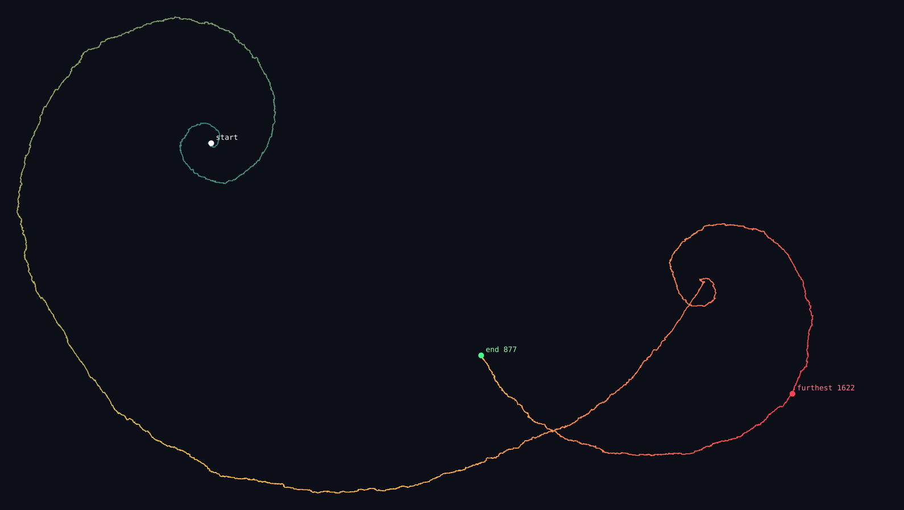
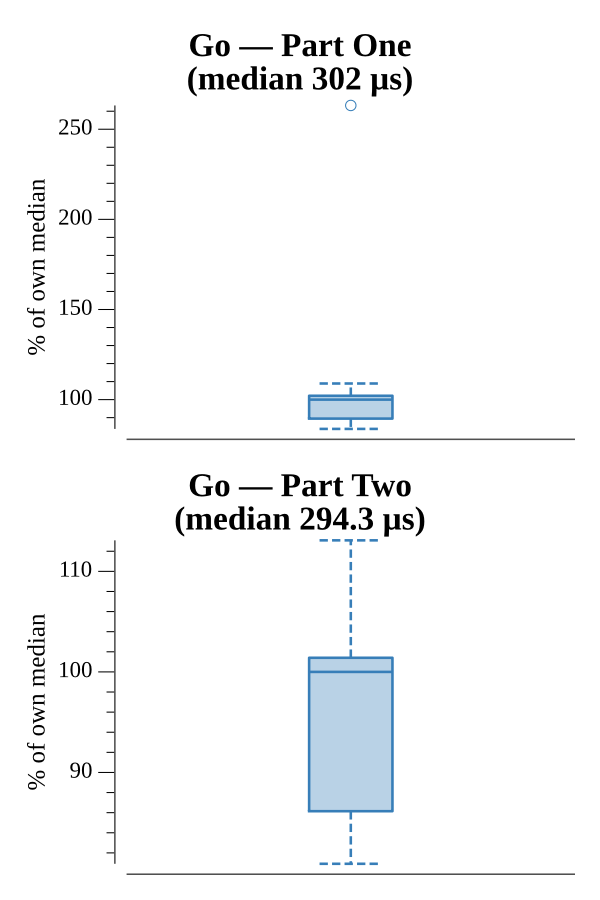

# [Day 11: Hex Ed](https://adventofcode.com/2017/day/11)

<!-- These are helper text to make formatting the yearly readme consistent and easier...

[Day 11: Hex Ed][rm11]
[Go][go11]

[rm11]: 11-hexEd/README.md
[go11]: 11-hexEd/go

-->

## Go

```text
────────────────────────────────────────
─         2017 Day 11: Hex Ed          ─
────────────────────────────────────────
Solving (Go)…
1.0:  PASS           304.130µs
2.0:  PASS           302.867µs
```

## Visualization

The full 8223-step walk plotted across the hex plane as a polyline (SVG), using
cube coordinates for exact hex geometry. Each segment is coloured by its
distance from the origin — teal near the centre, warming through gold to red at
the extremes — so the double-spiral trajectory reads at a glance. Markers show
the `start`, the `furthest` point reached (1622, Part Two), and the `end`
(877, Part One).



## Run Times


