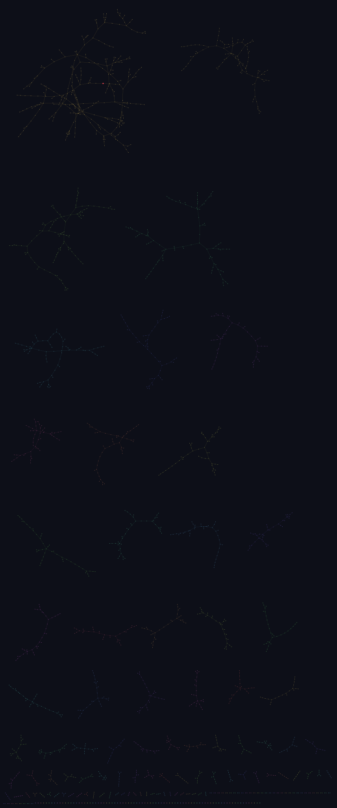
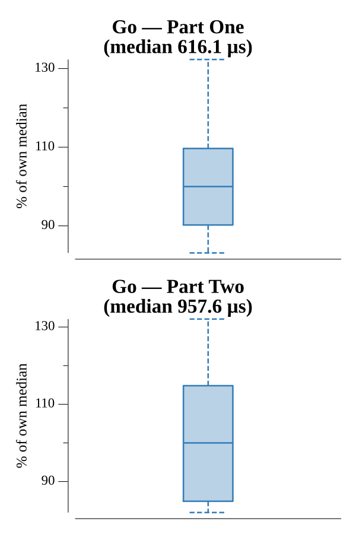

# [Day 12: Digital Plumber](https://adventofcode.com/2017/day/12)

<!-- These are helper text to make formatting the yearly readme consistent and easier...

[Day 12: Digital Plumber][rm12]
[Go][go12]

[rm12]: 12-digitalPlumber/README.md
[go12]: 12-digitalPlumber/go

-->

## Go

```text
────────────────────────────────────────
─     2017 Day 12: Digital Plumber     ─
────────────────────────────────────────
Solving (Go)…
1.0:  PASS           707.432µs
2.0:  PASS           854.136µs
```

## Visualization

All 211 connected groups of the pipe graph as force-directed "islands" (SVG).
Each component gets its own Fruchterman–Reingold layout and a distinct colour,
then the islands are shelf-packed largest-first — from the big trees down to the
singletons along the bottom. The group containing program `0` (Part One, 288
programs) is highlighted in gold with program `0` marked red.



## Run Times


