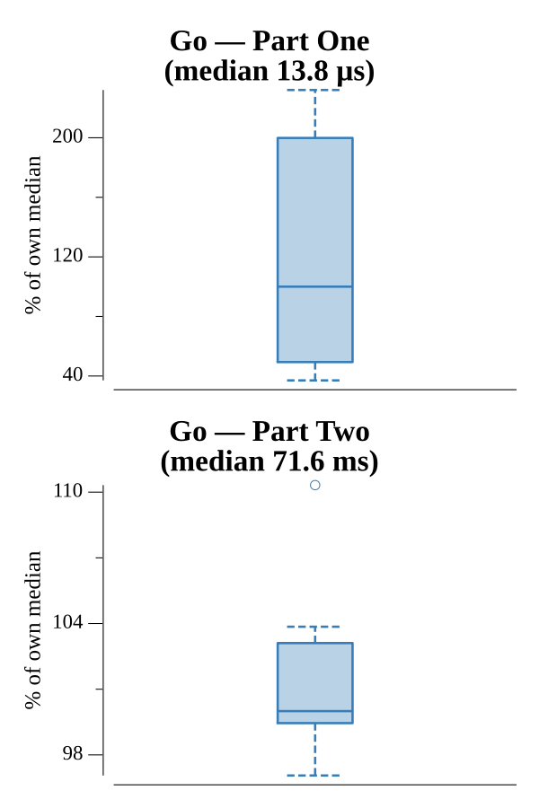

# [Day 13: Packet Scanners](https://adventofcode.com/2017/day/13)

<!-- These are helper text to make formatting the yearly readme consistent and easier...

[Day 13: Packet Scanners][rm13]
[Go][go13]

[rm13]: 13-packetScanners/README.md
[go13]: 13-packetScanners/go

-->

## Go

```text
────────────────────────────────────────
─     2017 Day 13: Packet Scanners     ─
────────────────────────────────────────
Solving (Go)…
1.0:  PASS             0.018ms
2.0:  PASS            78.923ms
```

## Run Times


