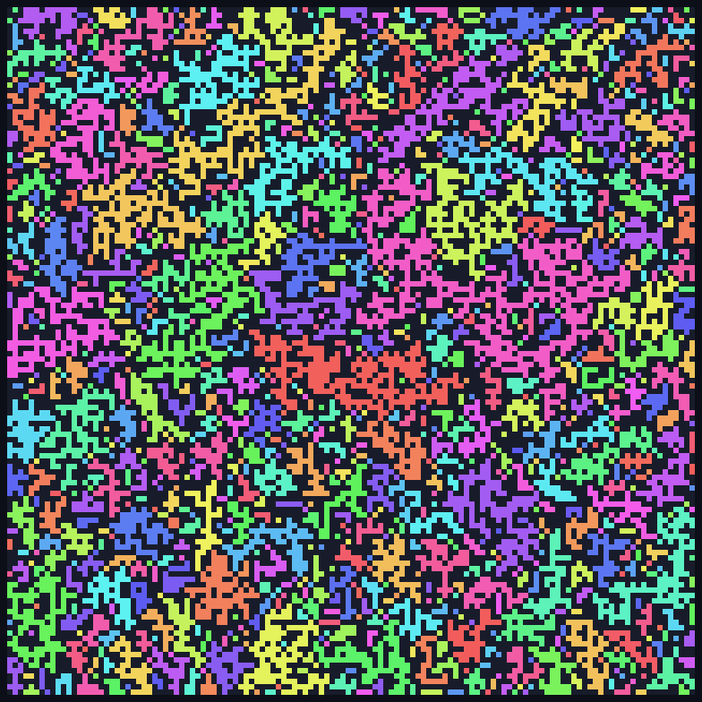
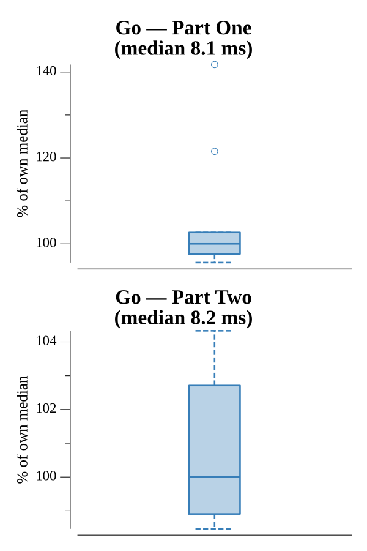

# [Day 14: Disk Defragmentation](https://adventofcode.com/2017/day/14)

<!-- These are helper text to make formatting the yearly readme consistent and easier...

[Day 14: Disk Defragmentation][rm14]
[Go][go14]

[rm14]: 14-diskDefragmentation/README.md
[go14]: 14-diskDefragmentation/go

-->

## Go

```text
────────────────────────────────────────
─  2017 Day 14: Disk Defragmentation   ─
────────────────────────────────────────
Solving (Go)…
1.0:  PASS             8.714ms
2.0:  PASS             9.111ms
```

## Visualization

The 128×128 disk grid built from 128 Knot Hashes (one per `key-<row>`), with each
used square coloured by its connected region. A golden-angle hue spread keeps
neighbouring regions distinct, so the 1113 regions and the bridges between clumps
of used squares stand out over the dark free space.



## Run Times


