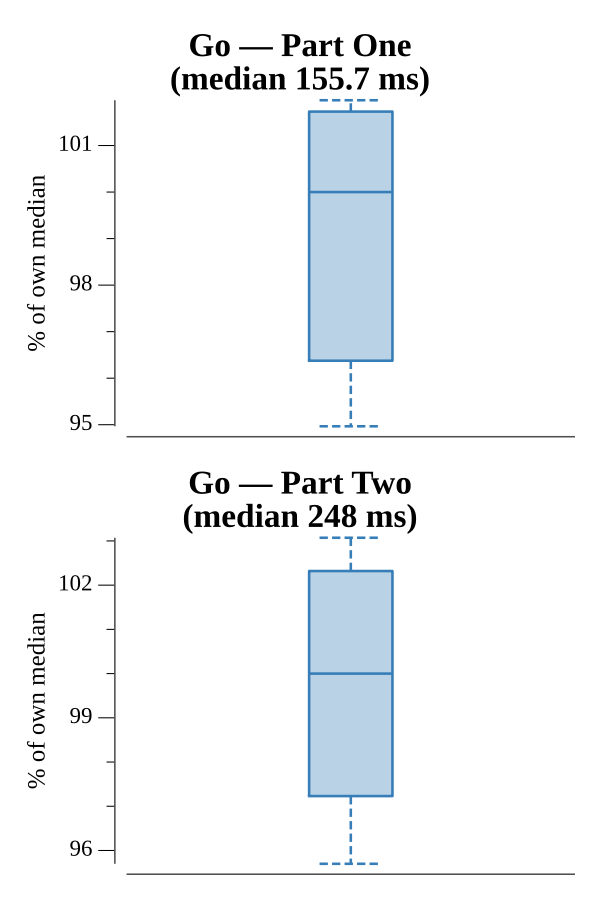

# [Day 15: Dueling Generators](https://adventofcode.com/2017/day/15)

<!-- These are helper text to make formatting the yearly readme consistent and easier...

[Day 15: Dueling Generators][rm15]
[Go][go15]

[rm15]: 15-duelingGenerators/README.md
[go15]: 15-duelingGenerators/go

-->

## Go

```text
────────────────────────────────────────
─   2017 Day 15: Dueling Generators    ─
────────────────────────────────────────
Solving (Go)…
1.0:  PASS           155.446ms
2.0:  PASS           256.011ms
```

## Run Times


