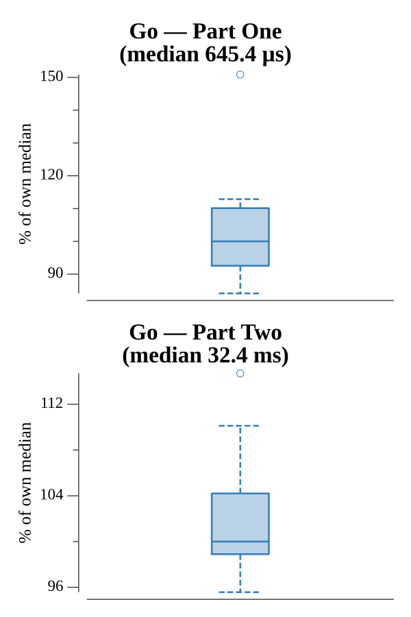

# [Day 16: Permutation Promenade](https://adventofcode.com/2017/day/16)

<!-- These are helper text to make formatting the yearly readme consistent and easier...

[Day 16: Permutation Promenade][rm16]
[Go][go16]

[rm16]: 16-permutationPromenade/README.md
[go16]: 16-permutationPromenade/go

-->

## Go

```text
────────────────────────────────────────
─  2017 Day 16: Permutation Promenade  ─
────────────────────────────────────────
Solving (Go)…
1.0:  PASS             0.689ms
2.0:  PASS            33.484ms
```

## Run Times


