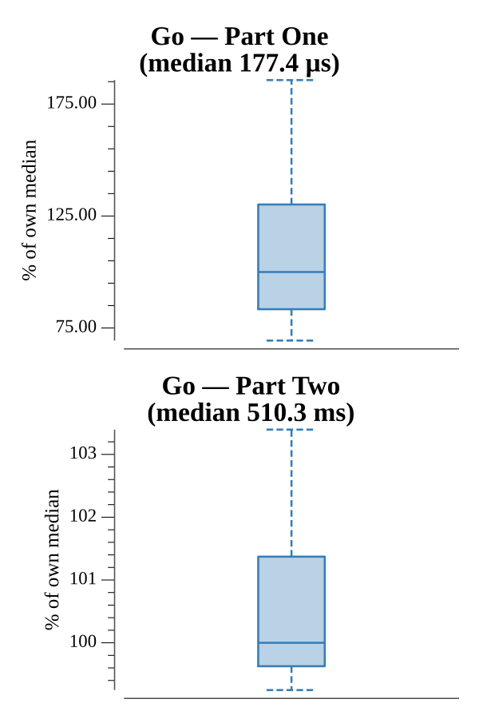

# [Day 17: Spinlock](https://adventofcode.com/2017/day/17)

<!-- These are helper text to make formatting the yearly readme consistent and easier...

[Day 17: Spinlock][rm17]
[Go][go17]

[rm17]: 17-spinlock/README.md
[go17]: 17-spinlock/go

-->

## Go

```text
────────────────────────────────────────
─        2017 Day 17: Spinlock         ─
────────────────────────────────────────
Solving (Go)…
1.0:  PASS             0.120ms
2.0:  PASS           537.373ms
```

## Run Times


