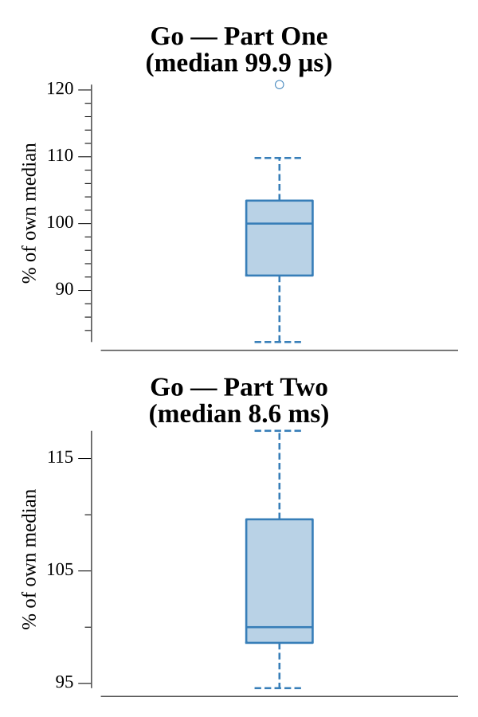

# [Day 18: Duet](https://adventofcode.com/2017/day/18)

<!-- These are helper text to make formatting the yearly readme consistent and easier...

[Day 18: Duet][rm18]
[Go][go18]

[rm18]: 18-duet/README.md
[go18]: 18-duet/go

-->

## Go

```text
────────────────────────────────────────
─          2017 Day 18: Duet           ─
────────────────────────────────────────
Solving (Go)…
1.0:  PASS             0.170ms
2.0:  PASS            10.250ms
```

## Run Times


