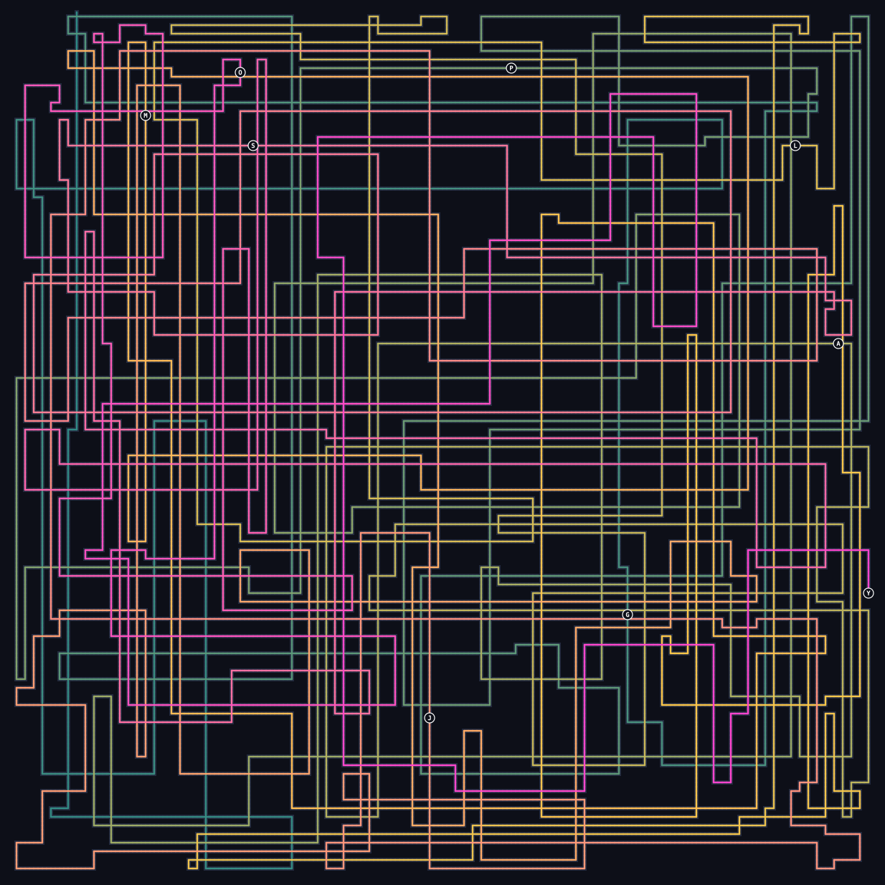
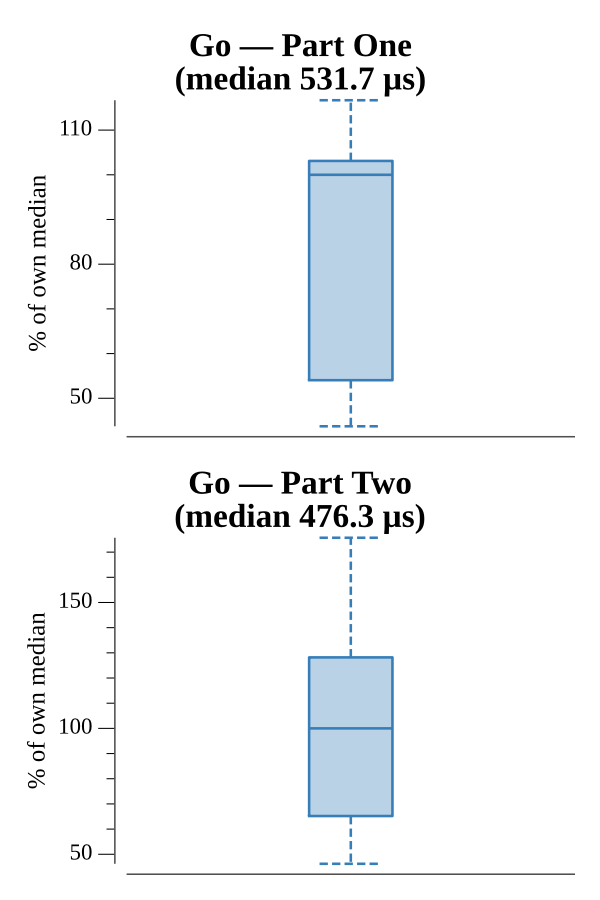

# [Day 19: A Series of Tubes](https://adventofcode.com/2017/day/19)

<!-- These are helper text to make formatting the yearly readme consistent and easier...

[Day 19: A Series of Tubes][rm19]
[Go][go19]

[rm19]: 19-aSeriesOfTubes/README.md
[go19]: 19-aSeriesOfTubes/go

-->

## Go

```text
────────────────────────────────────────
─    2017 Day 19: A Series of Tubes    ─
────────────────────────────────────────
Solving (Go)…
1.0:  PASS             0.602ms
2.0:  PASS             1.019ms
```

## Visualization

The routing diagram with the packet's full path overlaid as a crisp polyline
(SVG), coloured by traversal progress — teal at the start (top-left), warming
through gold to magenta at the end. The path folds back on itself constantly,
which is why it runs 16204 steps; each collected letter (`GPALMJSOY`) is drawn as
a labelled glyph at the cell where it's picked up.



## Run Times


