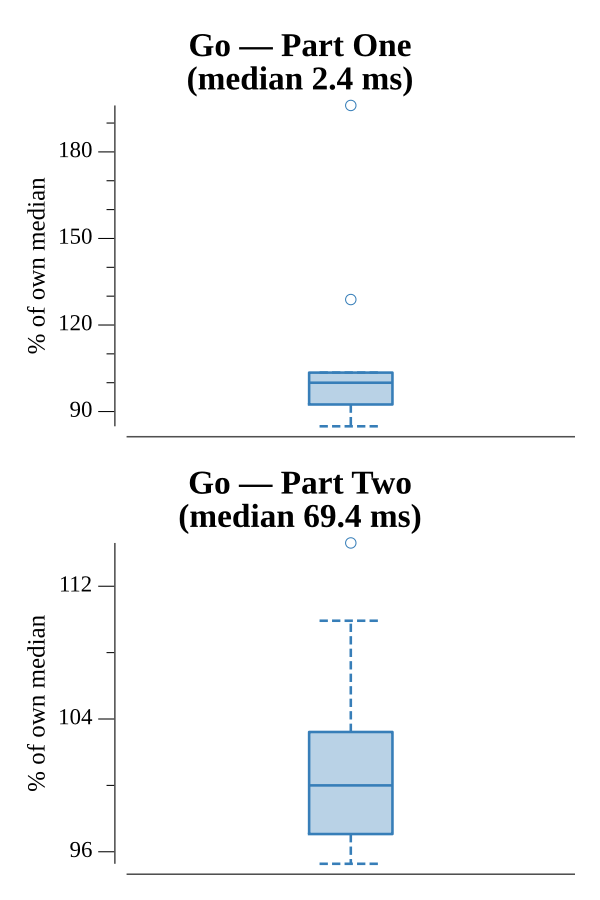

# [Day 20: Particle Swarm](https://adventofcode.com/2017/day/20)

<!-- These are helper text to make formatting the yearly readme consistent and easier...

[Day 20: Particle Swarm][rm20]
[Go][go20]

[rm20]: 20-particleSwarm/README.md
[go20]: 20-particleSwarm/go

-->

## Go

```text
────────────────────────────────────────
─     2017 Day 20: Particle Swarm      ─
────────────────────────────────────────
Solving (Go)…
1.0:  PASS             2.474ms
2.0:  PASS            68.978ms
```

## Visualization

The swarm animated over 90 ticks (GIF), projecting each particle onto the x/y
plane. The window frames the dense central cloud where particles converge and
collide — red flashes mark collisions as they resolve — while survivors spread
outward as their accelerations pull them apart.


## Run Times


