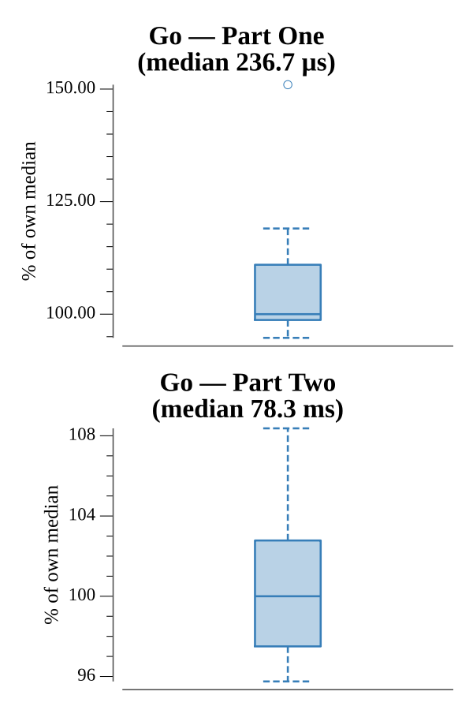

# [Day 21: Fractal Art](https://adventofcode.com/2017/day/21)

<!-- These are helper text to make formatting the yearly readme consistent and easier...

[Day 21: Fractal Art][rm21]
[Go][go21]

[rm21]: 21-fractalArt/README.md
[go21]: 21-fractalArt/go

-->

## Go

```text
────────────────────────────────────────
─       2017 Day 21: Fractal Art       ─
────────────────────────────────────────
Solving (Go)…
1.0:  PASS             0.283ms
2.0:  PASS            73.752ms
```

## Visualization

The pattern elaborating over all 18 enhancement passes (GIF), from the 3×3 seed
to the final 2187×2187 grid. The canvas is sized to that final grid so nothing is
ever downsampled: each cell always maps to a whole number of pixels — early grids
are integer-scaled up and centred, and the last pass lands at exactly one pixel
per cell. The coarse opening blocks give way to the crisp, self-similar tiling
that fills out over successive passes.


## Run Times


